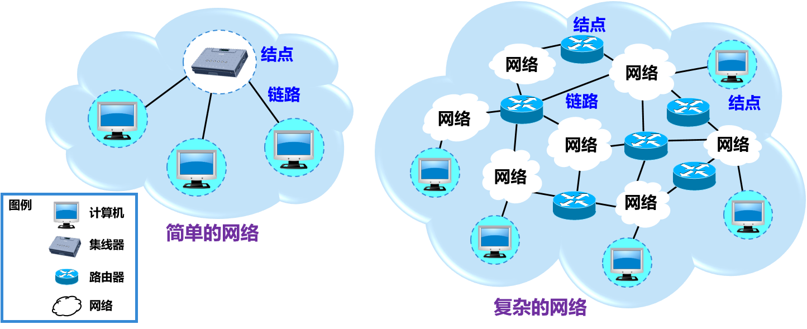
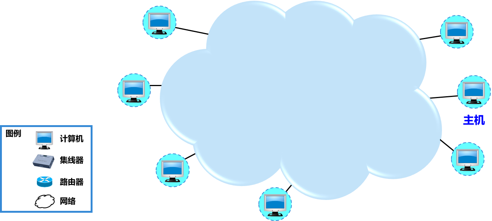

## 1.2 互联网概述

### 1.2.1 网络的网络

1. ***计算机网络（简称为网络）由若干结点（node）和连接这些结点的链路（link）组成。***

   > 网络中的结点可以是计算机、集线器、交换器或路由器等。
   >
   > 下图给出了一个具有 4 个结点和 3 条链路的网络。我们看到，有 3 台计算机通过 3 条链路连接到一个集线器上，构成了一个简单的计算机网络（简称为网络）。在很多情况下，我们可以用一朵云表示一个网络。这样做的好处是可以不去关心网络中的相当复杂的细节问题，因而可以集中精力研究涉及到与网络互联有关的一些问题。
   >
   > 

2. ***网络之间还可以通过路由器互连起来，这就构成了一个覆盖范围更大的计算机网络***。这样的网络称为互连网（internetwork 或 internet）。因此***互连网是 “网络的网络”（network of networks）***。

   > 当我们使用一朵云来表示网络时，可能会有两种不同的情况：
   >
   > 1. 如上图所示，用云表示的网络已经包含了和网络相连的计算机。
   >
   > 2. 有时为了讨论问题的方便（例如，要讨论几个计算机之间如何进行通信），也可以把有关的计算机画在云的外面，如下图所示。习惯上，与网络相连的计算机常称为主机（host）。这样，用云表示的互连网里面就只剩下许多路由器和连接这些路由器的链路了。
   >
   >    
   >
   > ***网络把许多计算机连接在一起，而互连网则把许多网络通过路由器连接在一起。与网络相连的计算机常称为主机。***
   >
   > 网络互连并不是把计算机仅仅简单地在物理上连接起来，因为这样做并不能达到计算机之间能够相互交换信息的目的。我们还必须在计算机上安装许多使计算机能够交换信息的软件才行。***因此当我们谈到网络互连时，就隐含地表示在这些计算机上已经安装了适当的软件，因而在计算机之间可以通过网络交换信息。***

3. 因特网（Internet）是世界上最大的互连网络（用户数以亿计，互连的网络数以百万计）。

   > internet 和 Internet 的区别：
   >
   > 1. 以小写字母 i 开始的 ***internet（互连网）是一个通用名词，它泛指由多个计算机网络互连而成的计算机网络。***在这些网络之间的通信协议（即通信规则）可以任意选择，不一定非要使用 TCP/IP协议。
   > 2. 以大写字母 I 开始的 Internet（互联网，或因特网）则是一个专用名词，它指当前全球最大的、开放的、由众多网络相互连接而成的特定互连网，它采用 TCP/IP 协议族作为通信的规则，且其前身是美国的 ARPANET。

### 1.2.2 互联网基础结构发展的三个阶段

互联网的基础结构大体上经历了 3 个阶段的演进：

1. 从单个网络 ARPANET 向互连网发展的过程。
   - 1969 年美国国防部创建的第一个分组交换网 ARPANET；
   - 20 世纪 70 年代中期，人们已认识到不可能仅使用一个单独的网络来满足所有的通信问题。于是 ARPA 开始研究多种网络（如分组无线电网络）互连的技术，这就导致了互连网的出现。这就成为